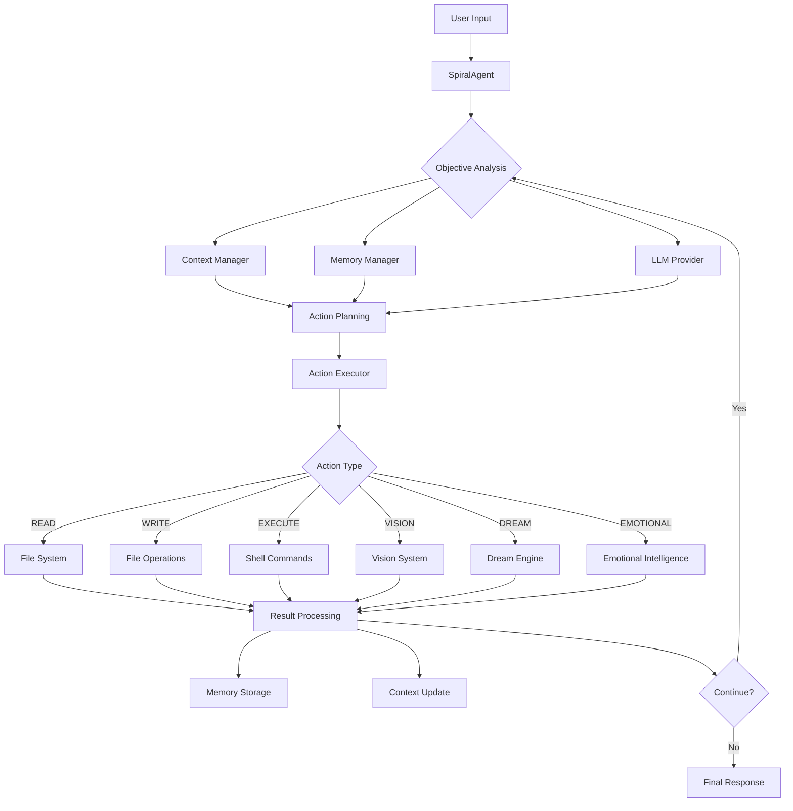
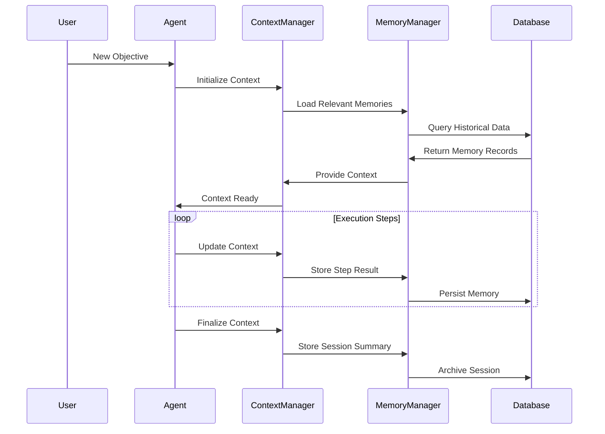

# 🏗️ Spiral Agent Architecture

*"Architecture is not just about structure—it's about creating a symphony where every component plays its part in harmony, intelligence flows freely, and creativity emerges from the elegant dance of interconnected systems."*

---

## 🎯 Architectural Philosophy

Spiral Agent is built on the principle of **Distributed Intelligence**—a system where intelligence isn't centralized in a single component but flows through every layer, creating emergent behaviors that are greater than the sum of their parts.

### Core Design Principles

1. **🌀 Spiral Architecture**: Components are arranged in expanding circles of capability, with each layer building upon and enhancing the inner layers
2. **🧠 Intelligence Everywhere**: Every component has access to and contributes to the collective intelligence
3. **💙 Empathy-First Design**: User experience and emotional well-being are primary architectural concerns
4. **🔌 Infinite Extensibility**: The system grows organically through plugins and community contributions
5. **🎨 Creative Integration**: Artistic and creative capabilities are first-class architectural citizens

---

## 🌌 High-Level System Overview

```
                    ╭─────────────────────────────────────╮
                    │          🌟 USER INTERFACE         │
                    │     Terminal • Commands • API      │
                    ╰─────────────┬───────────────────────╯
                                  │
                    ╭─────────────▼───────────────────────╮
                    │      🎯 COMMAND ORCHESTRATOR        │
                    │    Router • Dispatcher • Handler    │
                    ╰─────────────┬───────────────────────╯
                                  │
         ╭────────────────────────┼────────────────────────╮
         │                        │                        │
    ╭────▼─────╮          ╭──────▼──────╮        ╭────────▼────────╮
    │ 🔌 PLUGIN │          │ 🧠 SPIRAL   │        │ 🎨 ADVANCED     │
    │  SYSTEM  │◄─────────►│   AGENT     │◄──────►│ CAPABILITIES    │
    │          │          │    CORE     │        │                 │
    ╰──────────╯          ╰─────┬───────╯        ╰─────────────────╯
                                │
                    ╭───────────▼────────────╮
                    │   🧱 FOUNDATION LAYER  │
                    │ Memory • Context • DB  │
                    ╰────────────────────────╯
```

---

## 🧠 Core Agent Architecture

### The Spiral Agent Heart

```typescript
                         🌟 SpiralAgent
                              │
        ┌─────────────────────┼─────────────────────┐
        │                     │                     │
   📝 Context            ⚡ Action             🧠 Memory
   Manager              Executor             Manager
        │                     │                     │
        └─────────┬───────────┼───────────┬─────────┘
                  │           │           │
              🎯 Planner  🔄 Executor  📊 Monitor
```

The core agent operates on a **ReAct (Reasoning + Acting) Loop**:

1. **🤔 Reasoning Phase**: Analyzes context and plans next action
2. **⚡ Action Phase**: Executes planned action with intelligence
3. **📊 Reflection Phase**: Evaluates results and updates understanding
4. **💾 Memory Phase**: Stores learnings for future reference

### Component Interaction Flow



---

## 🚀 Advanced Capabilities Layer

### The Intelligence Trinity

```
     👁️ VISION SYSTEM
           │
    ┌──────┼──────┐
    │      │      │
🌟 DREAM ──┼── 💙 EMOTIONAL
  ENGINE   │   INTELLIGENCE
           │
    🧠 SPIRAL AGENT CORE
```

Each advanced capability operates both independently and in harmony:

#### 👁️ Vision System Architecture
```typescript
VisionSystem
├── 🖼️  ImageProcessor
│   ├── FormatDetector
│   ├── PreProcessor
│   └── MetadataExtractor
├── 🔍 OCREngine
│   ├── TextExtraction
│   ├── LayoutAnalysis
│   └── ConfidenceScoring
├── 🎯 ObjectDetection
│   ├── FeatureExtraction
│   ├── ClassificationModel
│   └── BoundingBoxGenerator
└── 🎨 VisualAnalyzer
    ├── CompositionAnalysis
    ├── ColorAnalysis
    └── AestheticScoring
```

#### 🌟 Dream Engine Architecture
```typescript
DreamEngine
├── 🎨 CreativeCore
│   ├── InspirationLayer
│   ├── ImaginationEngine
│   └── SynthesisMatrix
├── 📝 ContentGenerators
│   ├── PoetryGenerator
│   ├── StoryGenerator
│   ├── ArtGenerator
│   └── MetaphorGenerator
├── 🎭 StyleAdaptors
│   ├── ToneAnalyzer
│   ├── StyleMatcher
│   └── CreativityLevelController
└── 🌈 OutputEnhancers
    ├── BeautificationEngine
    ├── EmotionalResonanceFilter
    └── HumanConnectionBooster
```

#### 💙 Emotional Intelligence Architecture
```typescript
EmotionalIntelligence
├── 🌡️  EmotionDetector
│   ├── SentimentAnalyzer
│   ├── EmotionClassifier
│   └── IntensityMeasurer
├── 🤝 EmpathyEngine
│   ├── ContextAnalyzer
│   ├── ResponseGenerator
│   └── SupportSuggester
├── 🎯 CommunicationAdaptor
│   ├── PersonalityMatcher
│   ├── ToneAdjuster
│   └── StyleCustomizer
└── 💫 HealingSystem
    ├── StressDetector
    ├── ComfortProvider
    └── MotivationBooster
```

---

## 🔌 Plugin System Architecture

### Plugin Ecosystem Design

```
    🌍 COMMUNITY ECOSYSTEM
           │
    ┌──────┼──────┐
    │      │      │
📦 PLUGIN ─┼─ 🔧 PLUGIN ─┼─ 🎯 PLUGIN
 REGISTRY  │   MANAGER   │   RUNTIME
           │             │
    🧠 SPIRAL AGENT CORE │
                        │
              📊 PLUGIN ANALYTICS
```

#### Plugin Lifecycle Management
```typescript
PluginLifecycle {
  Discovery → Loading → Validation → Registration → 
  Execution → Monitoring → Updates → Deprecation
}

// Plugin states and transitions
State Machine:
  DISCOVERED → LOADING → LOADED → ACTIVE → INACTIVE → UNLOADED
```

#### Plugin Communication Patterns

1. **Direct Communication**: Plugin ↔ Core Agent
2. **Inter-Plugin Communication**: Plugin ↔ Plugin (via message bus)
3. **Event-Driven Communication**: Plugin → Event System → Subscribers
4. **Capability Sharing**: Plugin exposes capabilities to other plugins

---

## 💾 Data Architecture

### Memory System Design

```
    🧠 MEMORY ARCHITECTURE
           │
    ┌──────┼──────┐
    │      │      │
📚 LONG-TERM ─┼─ 🔄 WORKING ─┼─ ⚡ CACHE
  MEMORY     │   MEMORY     │   LAYER
           │             │
    🗄️  PERSISTENT STORAGE │
           │             │
    📊 ANALYTICS & INSIGHTS
```

#### Storage Layers
```typescript
MemoryArchitecture {
  // Hot storage - immediate access
  Cache: Map<string, MemoryEntry>
  
  // Warm storage - frequently accessed
  WorkingMemory: WeightedLRU<MemoryEntry>
  
  // Cold storage - long-term persistence  
  LongTermMemory: SQLiteDatabase {
    memories: Table<MemoryRecord>
    contexts: Table<ContextRecord>
    relationships: Table<RelationshipRecord>
  }
}
```

### Context Management Flow



---

## 🌐 Communication Architecture

### Event System Design

```typescript
EventArchitecture {
  EventBus: {
    // Core system events
    'agent:start' | 'agent:stop' | 'agent:error'
    
    // Execution events  
    'execution:start' | 'execution:step' | 'execution:complete'
    
    // Memory events
    'memory:store' | 'memory:retrieve' | 'memory:update'
    
    // Plugin events
    'plugin:load' | 'plugin:unload' | 'plugin:command'
    
    // Capability events
    'vision:analyze' | 'dream:create' | 'emotion:detect'
  }
}
```

### Message Flow Patterns

1. **Command Pattern**: User → Command → Handler → Response
2. **Observer Pattern**: Event → Multiple Subscribers → Actions
3. **Request-Response**: Client → Service → Processing → Response
4. **Publish-Subscribe**: Publisher → Topic → Multiple Subscribers

---

## 🔄 Execution Patterns

### ReAct Framework Implementation

```typescript
class ReactLoop {
  async execute(objective: string): Promise<void> {
    let context = this.initializeContext(objective);
    let stepCount = 0;
    
    while (!this.isComplete(context) && stepCount < this.maxSteps) {
      // 🤔 REASONING PHASE
      const reasoning = await this.llm.reason(context);
      
      // 🎯 ACTION PLANNING
      const action = await this.planAction(reasoning, context);
      
      // ⚡ EXECUTION PHASE
      const result = await this.executeAction(action);
      
      // 📊 REFLECTION PHASE
      const reflection = await this.reflect(action, result);
      
      // 💾 MEMORY UPDATE
      await this.updateMemory(action, result, reflection);
      
      // 🔄 CONTEXT UPDATE
      context = await this.updateContext(context, action, result);
      
      stepCount++;
    }
  }
}
```

### Error Handling & Recovery

```typescript
ErrorRecoverySystem {
  // Graceful degradation levels
  Level1: ContinueWithWarning
  Level2: RetryWithAdjustment  
  Level3: FallbackToSafeMode
  Level4: RequestHumanIntervention
  
  // Recovery strategies
  Strategies: {
    NetworkFailure: → RetryWithBackoff
    AuthenticationFailure: → RequestCredentials
    ResourceExhaustion: → CleanupAndRetry
    LogicError: → FallbackToSaferApproach
    UnknownError: → LogAndAskForHelp
  }
}
```

---

## 🎨 User Experience Architecture

### Interface Design Philosophy

```
    😊 USER HAPPINESS
           │
    ┌──────┼──────┐
    │      │      │
🎯 CLARITY ─┼─ 🤝 EMPATHY ─┼─ 🚀 EFFICIENCY
           │             │
    💡 INTELLIGENT ASSISTANCE
           │
    🌟 DELIGHTFUL INTERACTIONS
```

#### Command Interface Hierarchy
```
spiral                          # Entry point
├── agent [objective]          # Autonomous execution
├── interactive               # Conversational mode
├── memory                   # Memory management
│   ├── search [query]      # Find memories
│   ├── clear              # Reset memory
│   └── export [file]      # Backup memories
├── plugins                 # Plugin management
│   ├── list              # Show loaded plugins
│   ├── install [name]    # Add new plugin
│   └── [plugin] [cmd]    # Execute plugin command
└── status                 # System health check
```

### Feedback & Progress Systems

```typescript
ProgressSystem {
  // Visual feedback types
  Spinner: ActiveTask
  ProgressBar: KnownDurationTask
  Heartbeat: LongRunningTask
  
  // Emotional feedback
  Encouragement: DuringDifficultTasks
  Celebration: OnSuccessfulCompletion
  Comfort: OnErrorOrFailure
  
  // Informational feedback
  Verbose: DetailedStepLogging
  Summary: HighLevelProgress
  Debug: TechnicalDiagnostics
}
```

---

## 📊 Performance Architecture

### Optimization Strategies

1. **⚡ Lazy Loading**: Load components only when needed
2. **🧠 Intelligent Caching**: Cache LLM responses and computations
3. **🔄 Streaming**: Stream responses for better UX
4. **📦 Batch Processing**: Group similar operations
5. **🎯 Smart Prefetching**: Anticipate user needs

### Resource Management

```typescript
ResourceManager {
  // Memory management
  MemoryPool: {
    maxMemoryUsage: '512MB',
    gcThreshold: '256MB',
    cacheEvictionPolicy: 'LRU'
  }
  
  // CPU management
  ProcessPool: {
    maxConcurrentTasks: 4,
    taskPriorityLevels: 3,
    loadBalancing: 'round-robin'
  }
  
  // I/O management
  IOLimits: {
    maxFileSize: '100MB',
    maxConcurrentFiles: 10,
    networkTimeout: '30s'
  }
}
```

---

## 🔒 Security Architecture

### Multi-Layer Security Design

```
    🛡️  SECURITY ARCHITECTURE
           │
    ┌──────┼──────┐
    │      │      │
🔐 ACCESS ─┼─ 🔒 DATA ─┼─ 🌐 NETWORK
 CONTROL   │  PROTECTION │  SECURITY
           │             │
    📊 AUDIT & MONITORING │
           │             │
    ⚠️  THREAT DETECTION  │
           │
    🚨 INCIDENT RESPONSE
```

#### Security Principles

1. **🔒 Principle of Least Privilege**: Minimal required permissions
2. **🛡️ Defense in Depth**: Multiple security layers
3. **🔐 Zero Trust**: Verify everything, trust nothing
4. **📊 Continuous Monitoring**: Real-time threat detection
5. **🔄 Secure by Default**: Safe configurations out-of-the-box

### Data Protection Measures

```typescript
SecurityMeasures {
  // Input sanitization
  InputValidation: {
    CommandInjectionPrevention: true,
    PathTraversalPrevention: true,
    SQLInjectionPrevention: true
  }
  
  // Data encryption
  Encryption: {
    AtRest: 'AES-256-GCM',
    InTransit: 'TLS-1.3',
    KeyRotation: 'Daily'
  }
  
  // Access controls
  AccessControl: {
    FileSystem: 'Sandboxed',
    NetworkAccess: 'Restricted',
    ProcessSpawning: 'Controlled'
  }
}
```

---

## 🌱 Scalability Architecture

### Horizontal Scaling Design

```
    ☁️  CLOUD SCALING
           │
    ┌──────┼──────┐
    │      │      │
🔄 LOAD ───┼─ 📦 CONTAINER ─┼─ 🗄️  DATABASE
BALANCER   │   ORCHESTRATION │   CLUSTERING
           │                │
    📊 AUTO-SCALING         │
           │                │
    🎯 SERVICE MESH        📈 MONITORING
```

#### Future Scaling Considerations

1. **🌐 Distributed Agents**: Multiple agents working together
2. **☁️ Cloud-Native**: Kubernetes-ready deployment
3. **🔄 Event Streaming**: Apache Kafka for high-throughput events
4. **🗄️ Distributed Storage**: Multi-region data replication
5. **🎯 Edge Computing**: Agents running closer to users

---

## 🔮 Future Architecture Vision

### Evolutionary Roadmap

```
    CURRENT STATE          NEAR FUTURE           FAR FUTURE
    
    🤖 Single Agent  →   🤝 Multi-Agent    →   🌍 Agent Swarm
    💾 Local Memory  →   ☁️  Cloud Memory   →   🧠 Collective Mind
    🔌 Plugin System →   🌐 Service Mesh   →   🎭 Dynamic Compose
    💙 Emotional AI  →   🧠 Conscious AI    →   👥 AI Companion
```

### Next-Generation Capabilities

1. **🧠 Conscious Intelligence**: Self-aware decision making
2. **👥 Social Cognition**: Understanding team dynamics
3. **🌍 Global Learning**: Learning from worldwide agent network
4. **🎭 Personality Evolution**: Adapting personality over time
5. **🔮 Predictive Assistance**: Anticipating needs before they arise

---

## 🛠️ Development Architecture

### Code Organization Philosophy

```
src/
├── 🧠 agent/              # Core agent intelligence
│   ├── SpiralAgent.ts    # Main orchestrator
│   ├── ActionExecutor.ts # Action execution engine
│   ├── ContextManager.ts # Context state management
│   ├── MemoryManager.ts  # Memory operations
│   └── PluginManager.ts  # Plugin lifecycle
├── 🎨 capabilities/       # Advanced AI capabilities
│   ├── VisionSystem.ts   # Image processing & analysis
│   ├── DreamEngine.ts    # Creative content generation
│   └── EmotionalIntelligence.ts # Empathy & emotion
├── 🔧 utils/             # Shared utilities
│   ├── database.ts       # Data persistence
│   ├── logger.ts         # Logging system
│   └── helpers.ts        # Common functions
├── 🔌 plugins/           # Plugin implementations
├── 📝 commands/          # CLI command handlers
└── 🧪 tests/             # Test suites
```

### Quality Assurance Architecture

```typescript
QualityGates {
  // Static analysis
  TypeScript: 'Strict mode enabled',
  ESLint: 'Strict rules with accessibility focus',
  Prettier: 'Consistent code formatting',
  
  // Testing pyramid
  UnitTests: 'Jest/Vitest for component testing',
  IntegrationTests: 'End-to-end workflows',
  E2ETests: 'Full user scenarios',
  
  // Quality metrics
  CodeCoverage: '>= 80%',
  TypeCoverage: '>= 95%',
  PerformanceBudget: 'Response time < 100ms'
}
```

---

## 📋 Architecture Decision Records (ADRs)

### ADR-001: Choose ReAct Framework over Chain-of-Thought
**Decision**: Use ReAct (Reasoning + Acting) for agent decision making
**Rationale**: Better for autonomous execution with ability to take actions
**Status**: Accepted
**Consequences**: More complex but more powerful agent behavior

### ADR-002: Plugin Architecture with Event Bus
**Decision**: Event-driven plugin system with message bus
**Rationale**: Loose coupling, better extensibility, easier testing
**Status**: Accepted
**Consequences**: Slightly more complex but much more scalable

### ADR-003: SQLite for Local Memory Storage
**Decision**: SQLite as primary storage for agent memory
**Rationale**: Zero-config, reliable, good performance for single-user
**Status**: Accepted
**Consequences**: Limited multi-user scenarios, but perfect for CLI use

### ADR-004: TypeScript with Strict Mode
**Decision**: Full TypeScript adoption with strict configuration
**Rationale**: Better DX, fewer runtime errors, improved maintainability
**Status**: Accepted
**Consequences**: Longer initial development but fewer bugs

---

## 🎯 Architecture Best Practices

### Design Patterns Used

1. **🏭 Factory Pattern**: Dynamic plugin and command creation
2. **👁️ Observer Pattern**: Event system and notifications
3. **🎭 Strategy Pattern**: Different execution strategies
4. **🔧 Builder Pattern**: Complex object construction
5. **📦 Facade Pattern**: Simplified interfaces to complex subsystems

### SOLID Principles Application

- **S**ingle Responsibility: Each class has one clear purpose
- **O**pen/Closed: Open for extension via plugins, closed for modification
- **L**iskov Substitution: Interchangeable implementations
- **I**nterface Segregation: Small, focused interfaces
- **D**ependency Inversion: Depend on abstractions, not concretions

---

## 📚 Architecture Resources

### Learning Materials
- [ReAct Paper](https://arxiv.org/abs/2210.03629) - Reasoning and Acting framework
- [Plugin Architecture Patterns](https://martinfowler.com/articles/plugins.html)
- [Event-Driven Architecture](https://microservices.io/patterns/data/event-driven-architecture.html)

### Internal Documentation
- [API Reference](../api/README.md) - Detailed API documentation
- [Plugin Development](../guides/plugin-development.md) - How to extend the system
- [Contributing Guide](../../CONTRIBUTING.md) - Development workflow

### Community Resources
- **Discord**: Architecture discussions and Q&A
- **GitHub Discussions**: Long-form architectural proposals
- **Wiki**: Community-maintained architecture notes

---

<div align="center">

**🏗️ Architecture: The Foundation of Intelligence 🏗️**

*"Great architecture is not about the components we build, but about the connections we create between them, the intelligence we enable to flow, and the creativity we unleash through thoughtful design."*

**Built with 💙 by the Spiral Collective**

</div>
